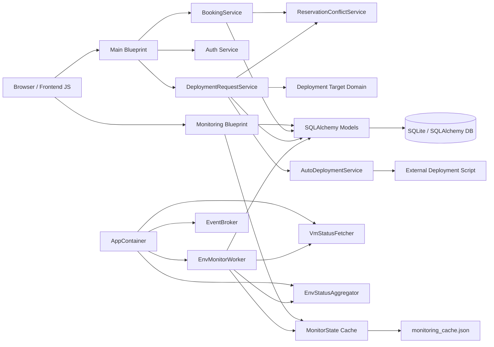
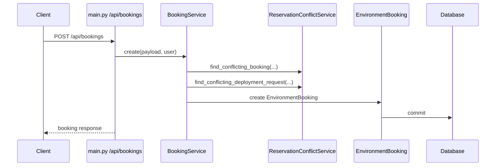
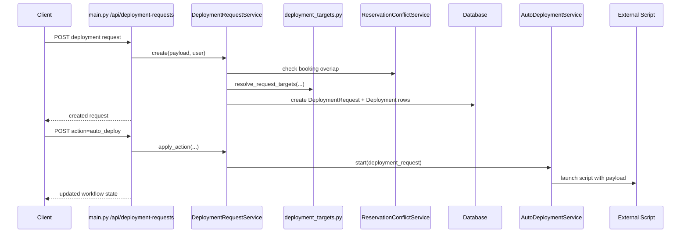
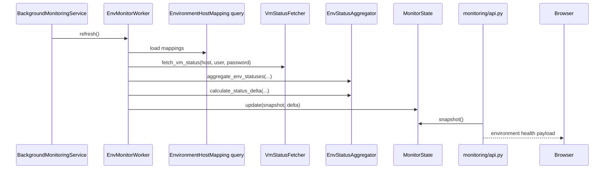

# EnvBooking Architecture

## Overview

EnvBooking is a Flask-based environment management application with two tightly related runtime concerns:

1. Environment booking and deployment request management.
2. Environment health monitoring and dashboard refresh.

The application follows a layered structure:

- `webapp/routes`: HTTP endpoints and HTML page rendering.
- `webapp/services`: booking and deployment workflows.
- `webapp/domain`: domain rules such as reservation conflict checks and deployment target resolution.
- `webapp/models.py`: SQLAlchemy persistence model.
- `monitoring/*`: monitoring refresh pipeline, shared state, and monitoring API endpoints.

The main app entry point is the Flask app factory in `webapp/__init__.py`. Local development runs through `run.py`, which starts both the Flask server and an embedded monitoring background thread.

## High-Level Runtime View

## Core Modules

### 1. Web Application Layer

- `webapp/__init__.py` creates the Flask app, configures logging, initializes `db`, `MonitorState`, and `AppContainer`, and registers blueprints.
- `webapp/routes/main.py` owns authentication pages, dashboards, booking APIs, deployment request APIs, and current deployment lookup APIs.
- `booking/routes/booking.py` is registered separately for booking-specific screens.

Responsibilities:

- Accept HTTP requests.
- Enforce login and screen access using decorators from `auth_service.py`.
- Delegate business logic to service classes instead of embedding workflow rules in routes.

### 2. Service Layer

The service layer contains the main business workflows.

#### `BookingService`

Responsibilities:

- Validate booking payloads through `BookingValidator`.
- Detect booking-to-booking conflicts.
- Detect booking-to-deployment conflicts through `ReservationConflictService`.
- Create, update, and cancel `EnvironmentBooking` records.

#### `DeploymentRequestService`

Responsibilities:

- Validate deployment request payloads.
- Resolve deployment scope (`ENV` vs `ENV_TYPE` for shared tool deployments).
- Resolve target packages and environment host mappings.
- Create `DeploymentRequest` and `Deployment` records.
- Progress deployment requests through approval and execution states.
- Trigger external auto-deployment scripts through `AutoDeploymentService`.
- Update `CurrentDeploymentState` after successful completion.

### 3. Domain Layer

#### `ReservationConflictService`

Encapsulates overlap logic between:

- `EnvironmentBooking`
- `DeploymentRequest`

This keeps time-window conflict rules outside the route layer and shared across workflows.

#### `deployment_targets.py`

Loads and normalizes deployment target definitions from `configs/deployment_targets.json`, then resolves:

- canonical target keys
- component types
- selected package keys
- concrete `EnvironmentHostMapping` targets

This module is the bridge between JSON target configuration and deployable DB-backed infrastructure mappings.

### 4. Data Layer

`webapp/models.py` is the canonical persistence model and currently contains:

- identity and access models: `User`, `Team`, `TeamMember`
- infrastructure models: `Environment`, `Host`, `ServerType`, `EnvironmentHostMapping`
- deployment models: `ComponentBuild`, `DeploymentRequest`, `Deployment`, `CurrentDeploymentState`
- reservation model: `EnvironmentBooking`

Important design choices:

- `EnvironmentHostMapping` is the central infrastructure join model that ties environment, host, and server type together.
- `DeploymentRequest` is the workflow parent record.
- `Deployment` stores per-target execution detail under a request.
- `CurrentDeploymentState` is the read-optimized snapshot of what is currently deployed per mapping/package.

### 5. Monitoring Subsystem

The monitoring subsystem is designed so the same refresh workflow can run:

- inside the Flask process for local/dev (`run.py`)
- in a standalone worker process (`monitoring/worker_main.py`)

Key parts:

- `AppContainer`: wires monitoring dependencies together.
- `EnvMonitorWorker`: executes one refresh cycle.
- `VmStatusFetcher`: fetches and parses raw VM/service status.
- `EnvStatusAggregator`: converts VM-level health into environment summaries and deltas.
- `MonitorState`: thread-safe in-memory snapshot plus persisted cache file.
- `monitoring/api.py`: exposes environment health as JSON and enriches it with booking activity and server-type metadata.

## Main Execution Flows

### Booking Flow

### Deployment Request Flow

### Monitoring Refresh Flow

## Architectural Strengths

- Clear route-to-service separation.
- Domain logic extracted from controllers.
- Monitoring pipeline is reusable across embedded and standalone modes.
- `CurrentDeploymentState` provides a stable read model for current deployments.
- `MonitorState` gives a thread-safe shared cache between refresh workers and HTTP reads.

## Current Boundaries And Practical Notes

- `models.py` is still a large consolidation point; the domain model is centralized rather than split by feature.
- Some legacy duplicate modules remain in `webapp/` alongside the newer `webapp/services/` and `webapp/domain/` packages. Current routes use the service/domain package structure.
- Monitoring fetch is currently stubbed by `VmStatusFetcher.service_status()` and is ready for a real remote execution adapter.
- Auto deployment is asynchronous and delegated to external scripts, so deployment orchestration crosses the Python process boundary intentionally.

## Suggested Documentation Pairing

- Use [CLASS_DIAGRAM.md](/d:/copilet_vscode/envbooking/docs/CLASS_DIAGRAM.md) for the structural view.
- Use this document for responsibility boundaries, runtime flows, and deployment/monitoring interactions.
