# EnvBooking Class Diagram

The diagram below focuses on the current core classes and relationships that drive bookings, deployments, and monitoring.

```mermaid
classDiagram
    class User {
        +string user_id
        +string email_id
        +string name
        +string password_hash
        +string role
        +bool is_active
        +team_names()
        +has_team(team_name)
    }

    class Team {
        +int team_id
        +string team_name
        +string description
    }

    class TeamMember {
        +int id
        +string user_id
        +int team_id
        +string role
    }

    class Environment {
        +string env_id
        +string env_type
        +string description
        +bool is_active
    }

    class Host {
        +int host_id
        +string hostname
        +string ip_address
        +string domain
    }

    class ServerRole {
        +int server_role_id
        +string role_key
        +string role_type
        +string description
    }

    class EnvironmentHostMapping {
        +int environment_host_mapping_id
        +string env_id
        +string env_type
        +bool is_shared
        +int server_role_id
        +int host_id
        +string deployment_user
        +string deployment_password
        +string role_key
        +to_dict()
    }

    class ComponentBuild {
        +int build_id
        +string component_type
        +string component_name
        +string version
        +string artifact_name
        +string artifact_path
        +to_dict()
    }

    class EnvironmentBooking {
        +string booking_id
        +string env_id
        +string requested_by
        +datetime start_time
        +datetime end_time
        +string booking_type
        +string status
        +string description
        +string user_timezone
        +normalized_status()
        +lifecycle_status(now)
        +is_cancelled()
        +is_mutable(now)
        +to_dict()
    }

    class DeploymentRequest {
        +string deployment_request_id
        +string env_id
        +string requested_env_type
        +string env_scope_type
        +string requested_by
        +datetime planned_start_time
        +int build_id
        +string target_key
        +string requested_version
        +string status
        +string execution_mode
        +get_selected_packages()
        +set_selected_packages(packages)
        +get_service_types()
        +set_service_types(service_types)
        +resolved_component_type()
        +resolved_component_name()
        +environment_display_label()
        +resolved_hostnames()
        +to_dict()
    }

    class Deployment {
        +int deployment_id
        +string deployment_request_id
        +int environment_host_mapping_id
        +string package_key
        +string package_name
        +string deployed_version
        +string deployment_status
        +env_id()
        +server_role_key()
        +host_id()
        +to_dict()
    }

    class CurrentDeploymentState {
        +int current_deployment_state_id
        +string env_scope_type
        +string env_id
        +string env_type
        +int environment_host_mapping_id
        +string target_key
        +string package_key
        +string package_name
        +string current_version
        +string source
        +string status
        +string updated_by
        +string deployment_request_id
        +to_dict()
    }

    class BookingValidator {
        <<service>>
        +validate_payload(data, user)
    }

    class BookingConflictChecker {
        <<service>>
        +find_conflict(env_id, start_time, end_time, exclude_booking_id)
    }

    class BookingService {
        <<service>>
        +create(data, user)
        +update(booking_id, data, user)
        +delete(booking_id, user)
    }

    class DeploymentRequestService {
        <<service>>
        +serialize(deployment_request, user)
        +list_requests(user, scope, status)
        +create(data, user)
        +apply_action(deployment_request_id, action, user, payload)
    }

    class ReservationConflictService {
        <<domain>>
        +is_enabled()
        +overlaps(start_a, end_a, start_b, end_b)
        +find_conflicting_booking(env_id, start_time, end_time, exclude_booking_id)
        +find_conflicting_deployment_request(env_id, start_time, end_time, exclude_deployment_request_id)
    }

    class AutoDeploymentService {
        <<integration>>
        +start(deployment_request)
    }

    class AppContainer {
        +app
        +monitor_state
        +event_broker
        +vm_status_fetcher
        +env_status_aggregator
        +env_worker
    }

    class MonitorState {
        +update(snapshot, delta)
        +snapshot()
        +delta()
        +previous()
        +load_persisted()
        +refresh_from_persisted()
    }

    class EventBroker {
        +publish(event_name, payload)
        +recent_events()
    }

    class VmStatusFetcher {
        +service_status(host, username, password)
        +parse_output(output_string)
        +fetch_vm_status(host, username, password)
    }

    class EnvStatusAggregator {
        +aggregate_env_statuses(vm_statuses, environments)
        +calculate_status_delta(old_state, new_state)
        +assign_env_status(vm_statuses)
    }

    class EnvMonitorWorker {
        +refresh()
    }

    User "1" --> "*" TeamMember : memberships
    Team "1" --> "*" TeamMember : members
    Environment "1" --> "*" EnvironmentBooking : bookings
    User "1" --> "*" EnvironmentBooking : requester
    Environment "1" --> "*" EnvironmentHostMapping : host_mappings
    ServerRole "1" --> "*" EnvironmentHostMapping : environment_mappings
    Host "1" --> "*" EnvironmentHostMapping : environment_mappings
    ComponentBuild "1" --> "*" DeploymentRequest : build
    User "1" --> "*" DeploymentRequest : requester
    User "1" --> "*" DeploymentRequest : approver
    DeploymentRequest "1" --> "*" Deployment : deployments
    EnvironmentHostMapping "1" --> "*" Deployment : deployments
    EnvironmentHostMapping "1" --> "*" CurrentDeploymentState : current_states
    DeploymentRequest "1" --> "*" CurrentDeploymentState : current_state_updates

    BookingService --> BookingValidator : uses
    BookingService --> BookingConflictChecker : uses
    BookingService --> ReservationConflictService : checks deployment overlap
    BookingService --> EnvironmentBooking : manages
    BookingService --> Environment : validates target env

    BookingConflictChecker --> ReservationConflictService : delegates booking conflict query

    DeploymentRequestService --> DeploymentRequest : manages
    DeploymentRequestService --> Deployment : creates target records
    DeploymentRequestService --> ComponentBuild : resolves build
    DeploymentRequestService --> CurrentDeploymentState : updates read model
    DeploymentRequestService --> ReservationConflictService : checks booking overlap
    DeploymentRequestService --> AutoDeploymentService : launches automation
    DeploymentRequestService --> EnvironmentHostMapping : resolves targets

    AppContainer --> EventBroker : creates
    AppContainer --> VmStatusFetcher : creates
    AppContainer --> EnvStatusAggregator : creates
    AppContainer --> EnvMonitorWorker : wires
    EnvMonitorWorker --> MonitorState : updates snapshot
    EnvMonitorWorker --> EventBroker : publishes refresh event
    EnvMonitorWorker --> VmStatusFetcher : fetches VM status
    EnvMonitorWorker --> EnvStatusAggregator : aggregates status
    EnvMonitorWorker --> EnvironmentHostMapping : queries mappings
```

## Notes

- `EnvironmentHostMapping` is the key infrastructure join entity used by both deployment resolution and monitoring refresh.
- `DeploymentRequest` is the workflow aggregate root for deployment operations.
- `MonitorState` is shared application state rather than a database model.
- `AppContainer` keeps monitoring collaborators explicit and easy to swap or test.
